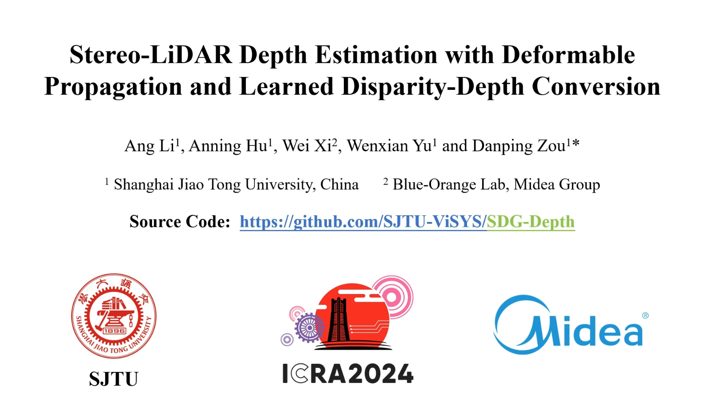
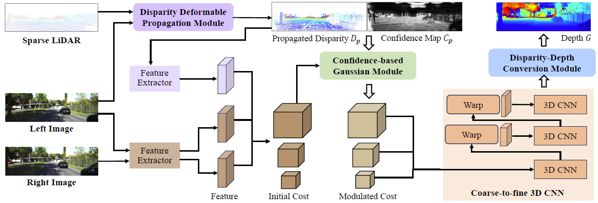

# Stereo-LiDAR Depth Estimation with Deformable Propagation and Learned Disparity-Depth Conversion
This repository contains the source code for our work:

[Stereo-LiDAR Depth Estimation with Deformable Propagation and Learned Disparity-Depth Conversion](https://arxiv.org/abs/2404.07545)  (ICRA 2024)<br/>

by [Ang Li](https://github.com/LiAngLA66), Anning Hu, Wei Xi, Wenxian Yu and Danping Zou. Shanghai Jiao Tong University and Midea Group<br/>

If you find this code useful in your research, please cite:
```
@article{li2024stereo,
  title={Stereo-LiDAR Depth Estimation with Deformable Propagation and Learned Disparity-Depth Conversion},
  author={Li, Ang and Hu, Anning and Xi, Wei and Yu, Wenxian and Zou, Danping},
  journal={arXiv preprint arXiv:2404.07545},
  year={2024}
}
```


## Watch Our Presentation Video!

<a href="https://www.youtube.com/watch?v=zArENrK5aOY&ab_channel=LiAng">
  
</a>

* The architecture of our network



## Environment
The code has been tested with PyTorch 1.8 and Cuda 11.1.
```Shell
conda env create -f environment.yaml
conda activate sdg
```


## Data Preparation
To evaluate/train SDG-Depth, you will need to download the required datasets. 
* [KITTI depth completion](https://www.cvlibs.net/datasets/kitti/eval_depth.php?benchmark=depth_completion)
* [Virtual KITTI2](https://europe.naverlabs.com/research-old2/computer-vision/proxy-virtual-worlds-vkitti-2/)
* [MS2](https://sites.google.com/view/multi-spectral-stereo-dataset/home)

By default `datasets.py` will search for the datasets in these locations. You can create symbolic links to wherever the datasets were downloaded in the `datasets` folder

```Shell
├── datasets
    ├── kitti_mono
        ├── 2011_09_26
            ├── 2011_09_26_drive_001_sync
                ├── image_02
                ├── image_03        
        ├── train 
            ├── 2011_09_26_drive_0001_sync
                ├── proj_depth
                    ├── groundtruth
                    ├── velodyne_raw        
        ├── val
            ├── 2011_09_26_drive_0002_sync
                ├── proj_depth
                    ├── groundtruth
                    ├── velodyne_raw                    
    ├── vkitti2
        ├── Scene01
          ├── 15-deg-left
              ├── frames
                  ├── depth
                  ├── rgb          
    ├── MS2
        ├── proj_depth
            ├── _2021-08-06-11-23-45
                ├── rgb
                    ├── depth_filtered
        ├── sync_data
            ├── _2021-08-06-11-23-45
                ├── rgb
                    ├── img_left        
    
```

## Evaluation
Pretrained models can be downloaded from [google drive](https://drive.google.com/drive/folders/1lJbS8iu2t7kD6qxub5VI36w8YM9zSnpH?usp=drive_link).

You can run a trained model with
```Shell
bash ./scripts/eval.sh
```


## Training

You can train a model from scratch on KITTI Depth Completion with

```Shell
bash ./scripts/train.sh
```


## Acknowledgements

Thanks to the excellent work RAFT-Stereo, CFNet, and EG-Depth. Our work is inspired by these work and part of codes are migrated from [RAFT-Stereo](https://github.com/princeton-vl/RAFT-Stereo), [CFNet](https://github.com/gallenszl/CFNet) and [EG-Depth](https://github.com/xzy-yqm/EG-Depth).